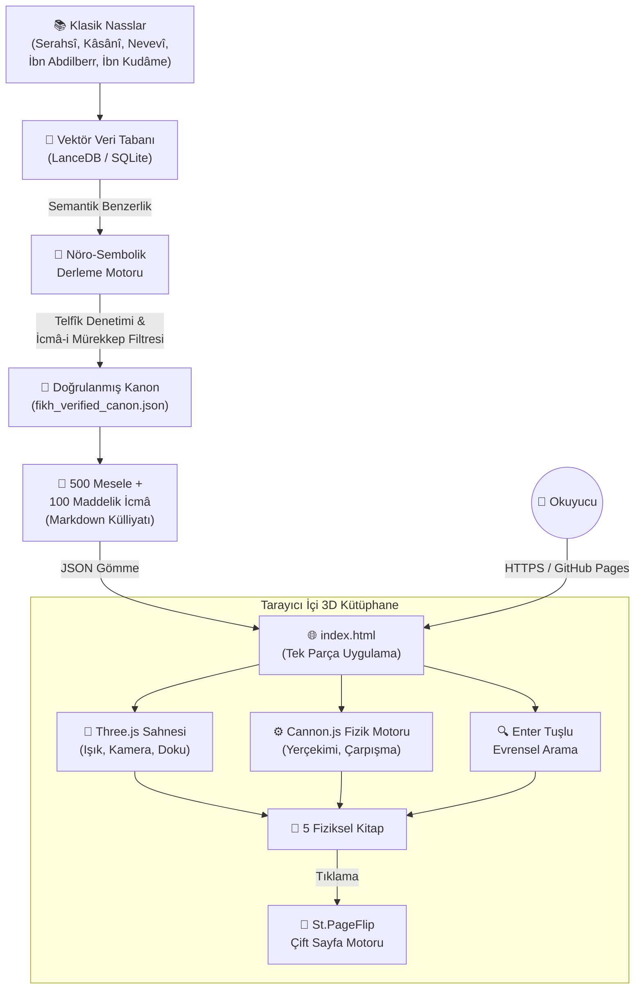

<div align="center">

```
 ███   ███  █   █ █████ █   █ ████
█   █ █   █ ██ ██   █   █   █ █   █
█     █   █ █ █ █   █   █   █ █   █
█     █████ █   █   █   █   █ ████
█     █   █ █   █   █   █   █ █ █
█   █ █   █ █   █   █   █   █ █  █
 ███  █   █ █   █ █████  ███  █   █

████  █   █ █   █  ███   ████
█   █ █   █ █   █ █   █ █
█   █ █   █ █   █ █   █ █
████  █   █ █████ █████  ███
█ █   █   █ █   █ █   █     █
█  █  █   █ █   █ █   █     █
█   █  ███  █   █ █   █ ████
```

# CÂMİU'R-RUHAS VE TAHKÎKU'L-MEZÂHİB

**Dört Hak Mezhep Esaslı, En Hafif ve Sahih Amelî Fıkıh Külliyatı**

*500 Mesele-i Hilâfiyye · 100 Maddelik İcmâ-i Kat'î Kanunnamesi · 3D WebGL / Fizik Motorlu İnteraktif Kütüphane*

[](https://threejs.org/)
[](https://schteppe.github.io/cannon.js/)
[](https://nodlik.github.io/StPageFlip/)
[](#ix-kurulum-dağıtım-ve-github-pages-yayını)
[](#iii-külliyatın-yapı-taşları-ve-bölüm-mimarisi)

[Repoyu Görüntüle](https://github.com/MuhammedCanCeylan/camiur-ruhas) · [Geliştirici Profili](https://github.com/MuhammedCanCeylan)

</div>

---

## İçindekiler

1. [Giriş ve Eserin Telif Sebebi](#i-giriş-ve-eserin-telif-sebebi)
2. [Fıkhî ve İlmî Metodoloji](#ii-fıkhî-ve-ilmî-metodoloji-usûlül-külliyat)
3. [Külliyatın Yapı Taşları ve Bölüm Mimarisi](#iii-külliyatın-yapı-taşları-ve-bölüm-mimarisi)
4. [Birinci Kısım: 500 Amelî Düğümün Sistematik Analizi](#iv-birinci-kısım-500-amelî-düğümün-sistematik-analizi-özet-kanon)
5. [İkinci Kısım: El-Müttefek Aleyh (100 Kesin İcmâ Kanunnamesi)](#v-i̇kinci-kısım-el-müttefek-aleyh-100-kesin-i̇cmâ-kanunnamesi)
6. [Sistem Mimarisi ve Veri Akışı](#vi-sistem-mimarisi-ve-veri-akışı)
7. [Dijital Mimari ve 3D Fiziksel Kütüphane Motoru](#vii-dijital-mimari-ve-3d-fiziksel-kütüphane-motoru)
8. [Yapay Zekâ ve Yazılım Mimarisi](#viii-yapay-zekâ-ve-yazılım-mimarisi-ai--software-engineering)
9. [Masadaki 5 Asıl Kitabın Kataloğu](#ix-masadaki-5-asıl-kitabın-kataloğu)
10. [Kurulum, Dağıtım ve GitHub Pages Yayını](#x-kurulum-dağıtım-ve-github-pages-yayını)
11. [Hâtime ve Mühür](#xi-hâtime-ve-mühür)

---

## I. Giriş ve Eserin Telif Sebebi

İslam Hukuku (Fıkıh); vahyin indiği andan itibaren mükellefin amellerini tanzim eden, dünyevî düzen ile uhrevî kurtuluş arasındaki köprüyü kuran ilahi bir nizamdır. Asr-ı Saadet'ten sonra İslam coğrafyasının genişlemesiyle birlikte yeni coğrafi, iktisadi ve sosyal örflerle karşılaşılmış; ashâb-ı kirâm, tâbiîn ve ardından müctehid imamlar devrinde nasların lafzî ve makāsıdî boyutları derinlemesine tahlil edilmiştir.

Bu tahliller neticesinde Ehl-i Sünnet ve'l-Cemâat omurgasını teşkil eden dört hak mezhep (Hanefî, Mâlikî, Şâfiî, Hanbelî) teşekkül etmiştir. Her bir mezhep, Kitap ve Sünnet'e bağlı kalmakla birlikte delillerin tearuzu, kıyasın kapsamı, maslahat, sedd-i zerâi' ve istihsan gibi fer'î usûl delillerinde farklı metodolojiler benimsemiştir.

Modern çağda ise sanayileşme, kentleşme, küresel iktisat ve dijitalleşmenin doğurduğu karmaşa; sıradan mükellefi (âmmî) fetvalar arasında sıkıştırmış, mezhep taassubu ile kontrolsüz telfîk (şer'î sınırları aşan keyfi birleşimler) tehlikesi arasında bir boşluk meydana getirmiştir.

**"Câmiu'r-Ruhas ve Tahkîku'l-Mezâhib"** işte bu ihtiyaca cevap vermek üzere telif edilmiştir:

- Dört hak mezhebin klasik fürûat ve kavil denizini taramak,
- Mükellefi meşakkat, hastalık, yolculuk, şehir hayatının getirdiği ızdırarlar ve iktisadi tıkanıklıklar anında meşru dairede rahatlatacak **en hafif (lite), sahih ve uygulanabilir ruhsatları** tahrîc etmek,
- Bunu yaparken "hevasına uyarak hüküm toplama" tehlikesine düşmemek için **Telfîk-i Bâtıl ve İcmâ-i Mürekkep Denetimi** uygulamak,
- Klasik ham nassları (Serahsî, Kâsânî, Nevevî, Şâfiî, İbn Abdilberr, İbn Kudâme) orijinal ibareleriyle dipnota bağlayarak akademik güvenilirliği sağlamak,
- Ve tüm bu ilmi mirası 21. yüzyıl teknolojisiyle buluşturarak **WebGL tabanlı, 3D fizik motorlu interaktif bir kütüphane** halinde sunmak.

---

## II. Fıkhî ve İlmî Metodoloji (Usûlü'l-Külliyat)

### 1. Dört Hak Mezhebin Meşruiyeti ve İhtilafın Tabiatı

Fukahâ arasındaki ihtilaf, dinde bir tefrika değil, ümmet için ilahi bir rahmet ve amel genişliğidir. Nitekim Ömer b. Abdülazîz, ashabın ihtilaf etmemiş olmasını asla arzu etmediğini; tek bir görüş üzerinde kalınsaydı dinde ruhsat ve genişliğin bulunmayacağını ifade etmiştir.

Külliyatın dayandığı dört mezhebin metodolojik temelleri:

| Mezhep | Usûl Ekseni | Karakteristik Yaklaşım |
|---|---|---|
| **Hanefî** | Rey ve İstihsan | Nassın zâhirinden daha kuvvetli maslahat/zaruret belirdiğinde cevazı genişleten istihsan, kamu örfü, akit hürriyeti |
| **Mâlikî** | Medine Ehlinin Ameli ve Maslahat-ı Mürsele | Âmme menfaatinin korunması, umum-ı belvâ anında tahâret/necasette geniş ruhsatlar |
| **Şâfiî** | Nassa Tam Sadakat | İbadetlerde şeklî/batınî rükünlerin korunması; akitlerde zâhirî irade beyanının esas alınması |
| **Hanbelî** | Hadis-i Şerif ve Şart Serbestisi | Akitlerde ibâha asıllığı, sözleşme şartlarının geçerliliği; meşakkat anında en geniş cem' yelpazesi |

### 2. En Hafif Ruhsat (er-Ruhsatu'l-Ehven) Seçim Kriteri

Külliyattaki 500 meselenin her birinde dört mezhebin hükümleri yan yana dizilmiş, ardından şu filtreden geçirilerek "Ruhsat ve Uygulanacak Hüküm" tayin edilmiştir:

- **Sahihlik Şartı** — Seçilen ruhsat, mezhep içinde şâz veya metrûk bir kavil değil; kurucu imamlara, mütekaddimîn tahkikine veya muteber müteahhirîn ulemaya dayanan kuvvetli bir tahrîctir.
- **Meşakkati İzale Prensibi** — Mecelle'nin *"Meşakkat teysîri celbeder"* (Madde 17) ve *"Bir iş dıyk oldukta vüs'at peydâ olur"* (Madde 18) kaideleri esas alınmıştır.
- **Kamu Maslahatı** — Özellikle çağdaş finans, tıp ve kentsel yaşam meselelerinde bireysel ibadet ferahlığı ile toplum düzeni arasındaki denge gözetilmiştir.

### 3. Telfîk-i Bâtıl ve İcmâ-i Mürekkep Denetimi

Fıkıhta telfîk, bir amel veya akitte birden fazla mezhebin görüşünü birleştirerek amel etmektir.

- **Câiz Telfîk** — Birbirine doğrudan illet bağıyla bağlı olmayan müstakil ibadet/muamelelerde farklı mezheplerin ruhsatlarıyla amel etmek (ör. abdestte Hanefî'nin niyet ruhsatı, kanamada Şâfiî'nin bozmama ruhsatı).
- **Bâtıl Telfîk (İcmâ-i Mürekkep)** — Dört mezhepten hiçbirinin kabul etmeyeceği, ortaya çıkan amelin icmâen geçersiz sayılacağı uydurma birleşimler (ör. velisiz, şahitsiz ve mehirsiz nikâh).

Külliyatta her meselenin yanına **"Telfîk Denetimi ve Fetvâ Güvencesi"** kutusu yerleştirilmiş; ruhsatın hangi şartlarla uygulanacağı net biçimde sınırlandırılmıştır.

---

## III. Külliyatın Yapı Taşları ve Bölüm Mimarisi

Külliyat toplamda **20 ana fıkıh kitabı**, **500 mesele-i hilâfiyye** ve **100 maddelik İcmâ Kanunnamesi**'nden oluşmaktadır.

```
camiur-ruhas/
├── index.html                         # 3D WebGL / Cannon.js / St.PageFlip tek parça uygulama
├── README.md                          # Bu dosya
│
├── kulliyat_metinleri/
│   ├── Camiur_Ruhas_Nihai_Kulliyat.md # 500 Mesele + İcmâ ana metni (~3.2 MB)
│   └── bolumler/                      # 20 fıkıh babının ayrıntılı markdown dosyaları
│       ├── 01_taharet.md              # Temizlik, Abdest, Gusül, Mest, Sular
│       ├── 02_salat.md                # Namaz Vakitleri, Kıraat, Rükû, Secde, Cem'
│       ├── 03_siyam.md                # Ramazan Orucu, İmsak, İftar, Kaza, Keffaret
│       ├── 04_buyu.md                 # Alım-Satım, Ribâ, Garar, İkāle, Selem
│       ├── 05_zekat.md                # Nisab, Havl, Altın/Gümüş, Matrah, Sarfiyat
│       ├── 06_hac.md                  # İhram, Tavaf, Say, Vakfe, Ramy-i Cimar
│       ├── 07_nikah.md                # Evlilik, Velayet, Mehir, Talak, İddet
│       ├── 08_etime.md                # Helal/Haram Gıdalar, Deniz Canlıları, İçecekler
│       ├── 09_kurban.md               # Udhiyye, Zebâyih, Kesim Usûlü, Ortaklık
│       ├── 10_eyman.md                # Yeminler, Nezirler, Keffaretler
│       ├── 11_muamelat_muasira.md     # Çağdaş Finans, Kartlar, Enflasyon, Krediler
│       ├── 16_tib_gunluk.md           # Tıbbi Müdahaleler, Biyoetik, Organ Nakli
│       ├── 17_cenaiz.md               # Cenaze Yıkama, Namaz, Defin, Iskat
│       ├── 18_feraiz.md               # Miras Hukuku, Terekede Haklar, Paylaşım
│       ├── 19_kaza.md                 # Yargılama Usûlü, Şahitlik, Yemin, İspat
│       ├── 20_hudud_cinayat.md        # Suç ve Ceza, Kısas, Diyet, Af
│       ├── 21_sirketler_vakif.md      # Şirket Türleri, Sermaye, Hisse, Vakıf
│       ├── 22_siyer_diyet.md          # Kamu Düzeni, Can Güvenliği, Tazminatlar
│       ├── 23_lukata_icare.md         # Buluntu Eşya, Kira Hukuku, Fesih Şartları
│       └── 24_modern_ve_sosyal.md     # Dijital Haklar, Kripto, Sosyal Medya (Mesele 251-500)
│
└── derleme_motoru/
    ├── checkpoint.json                # Yapay zekâ derleme ilerleme kayıtları (500/500 tamam)
    ├── fikh_hilaf_matrix.json         # 4 mezhep hüküm karşılaştırma matrisi
    ├── fikh_verified_canon.json       # Doğrulanmış fetva kanonu
    └── klasor_yapisi.txt              # Dosya ağacı dökümü
```

---

## IV. Birinci Kısım: 500 Amelî Düğümün Sistematik Analizi (Özet Kanon)

<details>
<summary><strong>1. Kitâbü't-Tahâret (Mesele 001–045)</strong></summary>

- **Abdestte Niyet** — Hanefî'ye göre niyet farz veya sıhhat şartı değil, müekked sünnettir.
- **Tertip ve Muvâlât** — Uzuvların sırasız yıkanması veya araya fasıla girmesi Hanefî'de abdesti bozmaz.
- **Vücuttan Kan Çıkması** — Şâfiî ve Mâlikî'ye göre sebilayn dışından çıkan kan/irin miktarı ne olursa olsun abdesti bozmaz.
- **Karşı Cinse Dokunma** — Hanefî'ye göre şehvetle dahi olsa çıplak tenle dokunmak fahiş mübâşeret derecesine varmadıkça abdesti bozmaz.
- **Mest Üzerine Mesh** — Mâlikî'de süre tahdidi yoktur; Hanefî'de 3 küçük parmak yırtığına kadar tolerans vardır.
- **Tırnakta Oje/Boya** — Mâlikî umum-ı belvâ tahrîcine göre çıkarılması zor olan boyaların altı yıkanmış sayılır.
- **Özür Halleri** — Mâlikî'ye göre gayriihtiyari özür hâllerinde her namaz için abdest yenilemek gerekmez.

</details>

<details>
<summary><strong>2. Kitâbü's-Salât (Mesele 046–085)</strong></summary>

- **Namazların Cem'i** — Şâfiî, Mâlikî ve Hanbelî'ye göre meşru sefer, şiddetli yağmur ve ağır meşakkat hâllerinde cem'-i takdîm/te'hîr caizdir.
- **İftitah Dışında El Kaldırmama** — Hanefî'de eller sadece iftitah tekbirinde kaldırılır.
- **İmama Uyanın Fatiha Okumaması** — Hanefî'ye göre imamın kıraati cemaatin kıraatidir.
- **Sehiv Secdesini Unutmak** — Şâfiî'ye göre sehiv secdesi sünnettir; unutulsa dahi namaz sahihtir.
- **Cuma Cemaati Sayısı** — Hanefî'de imam hariç 3 kişiyle cuma sahihtir.

</details>

<details>
<summary><strong>3. Kitâbü's-Sıyâm (Mesele 086–120)</strong></summary>

- **Unutarak Yiyip İçmek** — Cumhura göre unutarak yenilip içilmesi orucu bozmaz.
- **Keffâretin Sınırı** — Şâfiî ve Hanbelî'ye göre 60 günlük keffaret yalnızca bilerek cima etmeye mahsustur.
- **Tıbbi Müdahaleler** — Besleyici olmayan enjeksiyon, damla ve spreyler orucu bozmaz.
- **Seferde Oruç Açma** — Hanbelî'ye göre meşakkat olmasa dahi seferde ruhsatı kullanmak efdaldir.

</details>

<details>
<summary><strong>4. Kitâbü'z-Zekât (Mesele 121–150)</strong></summary>

- **Kadının Ziyneti** — Şâfiî, Mâlikî ve Hanbelî'ye göre şahsi kullanım ziynetinden zekât verilmez.
- **Borçların Düşülmesi** — Hanefî'ye göre vadesi gelmiş borçlar nisaptan düşülür.
- **Nakit Olarak Fitre/Zekât** — Hanefî'ye göre cari piyasa değeri üzerinden nakit ödenebilir.
- **Batık Alacaklar** — Mâlikî'ye göre tahsil edilemeyen alacaklarda yıllık zekât hesaplanmaz.

</details>

<details>
<summary><strong>5. Kitâbü'l-Hac ve'l-Umre (Mesele 151–180)</strong></summary>

- **Abdestsiz Tavaf** — Hanefî'ye göre tahâret vaciptir, sıhhat şartı değildir.
- **Müzdelife'den Erken Ayrılma** — Şâfiî ve Hanbelî'ye göre izdiham sebebiyle gece yarısından sonra ayrılmak caizdir.
- **Şeytan Taşlamada Vekâlet** — İzdiham/hastalık hâlinde vekâlet caizdir.
- **Âdetli Kadının Ziyaret Tavafı** — Zaruret tahrîcine göre sarınarak tavaf geçerlidir.

</details>

<details>
<summary><strong>6. Kitâbü'n-Nikâh ve't-Talâk (Mesele 181–220)</strong></summary>

- **Büluğ Çağındaki Kadının Bizzat Evlenmesi** — Hanefî'ye göre akıl baliğ kadın velisiz akit yapabilir.
- **Tek Mecliste Üç Boşama** — Mütekaddimîn tahrîcine göre tek talak sayılır.
- **Şiddetli Öfke Talakı** — İradeyi baskılayan gazap anındaki talak hükümsüzdür.
- **Süt Hısımlığı Sınırı** — Şâfiî ve Hanbelî'ye göre en az 5 ayrı doyurucu emzirme ile sabit olur.

</details>

<details>
<summary><strong>7. Kitâbü'l-Büyû' ve Muâmelât (Mesele 221–250)</strong></summary>

- **İstisnâ' (Sipariş Satışı)** — Hanefî'de istihsanen meşrudur.
- **Cezai Şart** — Hanbelî'ye göre inşaat/teslimat sözleşmelerinde bağlayıcıdır.
- **Fason Üretim ve Marka** — Lisans ve rıza dairesinde caizdir.
- **Kripto Varlıklar** — Hanefî/Mâlikî semen-i örfî tahrîcine göre mütekavvim mal hükmündedir.

</details>

<details>
<summary><strong>8. Çağdaş Finans, Modern Tıp ve Sosyal Düğümler (Mesele 251–500)</strong></summary>

- **Kripto Vadeli İşlemler** — Teslimatsız kaldıraçlı işlemler icmâen bâtıldır.
- **Hisse Senedi Temettü Arındırması** — AAOIFI standartlarına göre faiz payının bağışlanmasıyla caiz olur.
- **Organ Nakli ve Kornea** — Beyin ölümü sonrası rızaen nakil ittifakla caizdir.
- **Bebek Cinsiyeti ve Amniyosentez** — Teşhis amaçlı testler mubahtır.
- **Elektronik Kalp Pili ve Sensörler** — Gusül ve secdeye mâni değildir.
- **Gurbette Medeni Boşanma** — Protokolün imzalanması şer'î talak iradesi yerine geçer.
- **Otomatik Abonelikler (SaaS/Streaming)** — Rıza dairesinde geçerli bir icâre akdidir.

</details>

---

## V. İkinci Kısım: El-Müttefek Aleyh (100 Kesin İcmâ Kanunnamesi)

Külliyatın ikinci kısmı, fürûat ihtilaflarının bittiği ve İslam Hukuku'nun sarsılmaz omurgasını teşkil eden **100 icmâî ilkeyi** kanun maddeleri hâlinde vazetmektedir. Bu maddelerde hiçbir mezhepte ruhsat, telfîk veya farklı kavil bulunmaz:

| Madde Aralığı | Konu | Özet |
|---|---|---|
| 1–10 | Tahâret Asılları | 4 uzvun yıkanması farzdır; hades hâlleri abdesti icmâen bozar; cünüplükte gusül farzdır. |
| 11–20 | Namaz Asılları | 5 vakit namaz farz-ı ayndır; setr-i avret, taharet, kıble, vakit şarttır; kasten konuşmak namazı bozar. |
| 21–30 | Oruç Asılları | Ramazan orucu farzdır; kasten yiyip içmek ve cima orucu bozar. |
| 31–40 | Zekât Asılları | Nisap malında zekât farzdır; oran nakitte %2.5'tir; usül-fürûya zekât verilemez. |
| 41–50 | Hac Asılları | Ömürde bir kez farzdır; Arafat vakfesi ve ziyaret tavafı rükündür. |
| 51–65 | Nikâh Asılları | Şahitsiz nikâh bâtıldır; mahremlerle evlilik ebediyen haramdır; nafaka kocaya farzdır. |
| 66–80 | Ticaret ve Haramlar | Ribâ, kumar, fahiş garar ve gasp icmâen haram/bâtıldır. |
| 81–90 | Biyoetik ve Can Güvenliği | Masumu öldürmek ve intihar haramdır; 120 gün sonrası kürtaj -zaruret olmadıkça- haramdır. |
| 91–100 | Gıda ve Helaller | Domuz eti mutlak haram, leş ve akan kan necistir, sarhoşluk veren her içki haramdır. |

---

## VI. Sistem Mimarisi ve Veri Akışı



**Veri akışı özeti:**
`Klasik Nasslar` → `Vektör İndeksleme` → `Nöro-Sembolik Derleme Motoru` → `Telfîk Denetimi` → `Doğrulanmış Kanon` → `Markdown Külliyat` → `Tek Parça HTML/WebGL Uygulaması` → `3D Kütüphane Deneyimi`

> Not: Üretim/derleme aşaması (Python + LLM tabanlı tahrîc motoru) çevrimdışı bir süreçtir; nihai çıktı olan `index.html`, sıfır sunucu bağımlılığıyla doğrudan tarayıcıda çalışır.

---

## VII. Dijital Mimari ve 3D Fiziksel Kütüphane Motoru

Bu proje sadece teorik bir metin derlemesi değildir; modern bilgisayar grafikleri ve web mühendisliğinin imkânlarıyla donatılmış bir 3D WebGL kütüphanesidir.

### 1. 3D Sahne ve Görsel Kompozisyon (Three.js)

- **Kamera ve Perspektif** — 32 derecelik dar açılı `PerspectiveCamera`, kitapların perspektif bozulmalarını (fisheye etkisi) önler.
- **Işıklandırma Tasarımı**
  - `SpotLight` (Merkez Odak) — kenarlara doğru azalan (decay=1.2, penumbra=0.6) loş stüdyo spotu.
  - `DirectionalLight` (Anahtar Işık) — altın yaldızları parlatan, 60 derecelik sıcak ışık.
  - `PointLight` (Dolgu Işığı) — sol taraftan yumuşak turuncu yansıma.
- **Yeşil Çuha ve Altın Panel Masası** — 2048×2048 çözünürlükte prosedürel kumaş dokusu, maun ahşap pervazlar, 5 kitap + 3 inceleme panelli masa.

### 2. Gerçek 3D Fizik Motoru (Cannon.js Entegrasyonu)

Kitaplar basit animasyonlarla değil; kütle, yer çekimi, sürtünme ve çarpışma matrislerine sahip **katı cisimler (RigidBody)** olarak yaşar:

- **Yer Çekimi** — `world.gravity.set(0, -45, 0)` ile kitaplar masaya tok biçimde düşer, seker ve dengelenir.
- **Sarkma Fiziği** — Fareyle tıklanan yerel pivot noktası (`localPivot`) tespit edilir; oraya `PointToPointConstraint` bağlanır. Kitap havada fiziksel olarak sarkar ve salınır.
- **Üst Üste Dizme ve Devrilme** — Kitaplar birbirinin içinden geçmez; kule yapılabilir, alttaki kitap çekilince üsttekiler devrilir.

### 3. Çift Sayfalı Gerçekçi Sayfa Çevirme (St.PageFlip)

- 3D kitap tıklandığında masa kamerasından fırlayarak ekrana oturur, St.PageFlip motoru devreye girer.
- Sayfa köşesinden tutulup sürüklendiğinde ışık/gölge geçişleriyle gerçek kâğıt gibi kıvrılır.
- **Matematiksel Çift Sayfa Garantisi** — Her cildin toplam sayfa sayısı, motor kilitlenmesini önlemek için çift sayıya tamamlanmıştır.

### 4. Akıllı Tipografi ve Tema Kontrolü

- **A− / A+ Ölçeklendirme** — Tüm metinler `currentFontSize` değişkenine bağlıdır; 10px–30px arası 20 kademe.
- **Gece Modu (Dark Mode)** — 🌙 butonuyla kâğıt arka planı koyu kahveye, mürekkep altın sarısına döner.
- **Altın Kaydırma Çubuğu** — Uzun tahlillerin taşmasını önleyen özel webkit scrollbar tasarımı.

### 5. Apple / Steam Tarzı Başarım Sistemi (Achievement Toast)

| Rozet | Kazanım Koşulu |
|---|---|
| 🏆 İlim Tâlibi | Külliyatı ilk kez açmak |
| 🏆 Mimar | Fizik motoruyla kitaplardan kule yapmak |
| 🏆 Kitap Kurdu | Bir ciltte 3'ten fazla sayfa çevirmek |
| 🏆 Gece Kuşu | Gece modunu aktifleştirmek |
| 🏆 Araştırmacı | Arama motorunu kullanmak |
| 🏆 Klasik Âlim | Orijinal Arapça metinleri incelemek |

### 6. Enter Tuşlu Evrensel Arama Motoru

Arama terimi girilip **Enter** tuşuna basıldığında; 500 mesele başlığı ve ruhsatı, 100 icmâ kanunu ve SQLite veritabanındaki yüzlerce orijinal Arapça nass aynı anda taranır. Sonuçtan bir maddeye tıklandığında sistem ilgili kitabı masadan alıp açar ve doğrudan o sayfaya çevirir.

---

## VIII. Yapay Zekâ ve Yazılım Mimarisi (AI & Software Engineering)

Bu proje, geleneksel metin tahrîci ile modern yapay zekâ ve web grafik mühendisliğini birleştiren **uçtan uca (end-to-end)** bir yazılım projesidir.

### 1. Nöro-Sembolik Yapay Zekâ Derleme Motoru (`NeuroSymbolicFikhEngine`)

- **Hibrit Metodoloji** — Büyük dil modellerinin (LLM) dil anlama ve bağlam kurma kabiliyeti, İslam fıkhının katı usûl kurallarıyla (sembolik kurallar) sınırlandırılmıştır. LLM'in keyfi fetva üretmesi (halüsinasyon), katı telfîk kontrol filtreleriyle engellenmiştir.
- **Vektör Veri Tabanı ve Semantik Arama** — Klasik külliyat (`fikh_corpus.db` ve `LanceDB`), Arapça nass parçalarına ayrılarak (chunking) vektörel uzayda indekslenmiştir. Sorgulanan her mesele için kütüphanedeki en yakın aslî nasslar (Serahsî, Nevevî vb.) semantik benzerlikle çekilmiş ve tahrîc promptlarına enjekte edilmiştir.
- **Asenkron ve Hata Toleranslı İşçi Havuzu (Worker Pool)** — Meselelerin üretimi ve derlenmesi `ThreadPoolExecutor` ile paralel iş parçacıklarına bölünmüş; bağlam penceresi (context window) taşmalarına karşı `checkpoint.json` durum takip sistemiyle veri kaybı sıfıra indirilmiştir.

### 2. İstemci Tarafı (Client-Side) ve Sıfır Sunucu Bağımlılığı

- **Tek Parça Dağıtım (Single-File Distribution)** — Projenin web ayağı (`index.html`), hiçbir harici Node.js sunucusuna, PHP ortamına veya harici CDN CSS/JS bağımlılığına ihtiyaç duymaz.
- **DOM İçi Güvenli Veri Kapsülü** — 500 meselenin 4 mezhep tahlili ve klasik nasslar, JavaScript içine doğrudan dize olarak değil, `<script type="application/json">` bloğu içine temiz metin olarak gömülmüştür. Bu sayede tarayıcı tarafında dize kaçış hataları (SyntaxError) ve bellek sızıntıları engellenmiştir.

### 3. Grafik ve Fiziksel Simülasyon Katmanı

- **WebGL ve Three.js Mimarisi** — Sahne; gölge haritaları (PCFSoftShadowMap), ACES Filmic ton eşleme ve prosedürel maun dokusuyla, tarayıcı GPU'su üzerinde 60 FPS stabil çalışacak şekilde optimize edilmiştir.
- **Cannon.js ile Rijit Cisim Fiziği** — Kitaplar sanal birer kutu değil; yerçekimi, açısal sönümleme (angular damping) ve kütle merkezine sahip dinamik fiziksel nesnelerdir. Farenin tıkladığı yerel pivot noktasına uygulanan `PointToPointConstraint`, nesnenin yer çekimi altında doğal biçimde sarkmasını ve süzülmesini sağlar.
- **St.PageFlip ile Çift Sayfa Senkronizasyonu** — Gerçek kâğıt deformasyonu matematiksel olarak modellenmiş, sayfa sayısı çift sayı sınırına kilitlenerek render aşım hataları giderilmiştir.

> **Teknoloji Yığını:** Vanilla JavaScript (ES6+) · Three.js · Cannon.js · St.PageFlip · LanceDB · SQLite · Python (`ThreadPoolExecutor`) · LLM tabanlı tahrîc motoru

---

## IX. Masadaki 5 Asıl Kitabın Kataloğu

| # | Cilt | Renk | İçerik |
|---|---|---|---|
| 1 | **Câmiu'r-Ruhas ve Tahkîku'l-Mezâhib** | Bordo | Projenin ana eseri: 500 mesele-i hilâfiyye, en ehven ruhsatlar, 4 mezhep mukayesesi, telfîk denetimleri, 100 maddelik İcmâ Kanunnamesi. |
| 2 | **El-Mebsût ve'l-Bedâi'** | Zümrüt Yeşili | Hanefî mezhebinin kurucu metinleri: Serahsî'nin *el-Mebsût*'u ve Kâsânî'nin *Bedâiü's-Sanâi'*. |
| 3 | **El-Ümm ve'l-Mecmû'** | Safir Mavi | Şâfiî mezhebinin ana kaynağı: İmam Şâfiî'nin *el-Ümm*'ü ve Nevevî'nin *el-Mecmû' Şerhu'l-Mühezzeb*'i. |
| 4 | **El-Kâfî ve'l-Mevâhib** | Hardal / Kehribar | Mâlikî mezhebinin omurgası: İbn Abdilberr'in *el-Kâfî*'si ve el-Hattâb'ın *Mevâhibü'l-Celîl*'i. |
| 5 | **El-Muğnî ve'l-Keşşâf** | Mor / Mürdüm | Hanbelî mezhebinin mukayeseli ansiklopedisi: İbn Kudâme'nin *el-Muğnî*'si ve el-Buhûtî'nin *Keşşâfü'l-Kınâ'*'sı. |

---

## X. Kurulum, Dağıtım ve GitHub Pages Yayını

Proje sıfır bağımlılıkla (Zero-Dependency), harici bir sunucuya veya veritabanı motoruna ihtiyaç duymadan doğrudan tarayıcı üzerinde çalışacak şekilde tasarlanmıştır.

### 1. Yerel Çalıştırma

Klasördeki `index.html` dosyasına çift tıklayarak Chrome, Edge, Firefox veya Safari'de anında açabilirsin.

### 2. GitHub Pages ile Yayına Alma

```bash
# Proje klasörüne gir
cd camiur-ruhas

# Git reposunu başlat
git init
git add .
git commit -m "feat: Camiur-Ruhas 3D Külliyat v1.0"
git branch -M main

# Uzak repoyu ekle ve gönder
git remote add origin https://github.com/MuhammedCanCeylan/camiur-ruhas.git
git push -u origin main
```

Ardından GitHub repo ayarlarından **Settings → Pages** menüsüne girip dal olarak `main`, dizin olarak `/(root)` seçildiğinde, site birkaç dakika içinde

```
https://muhammedcanceylan.github.io/camiur-ruhas/
```

adresinde 3D fizik motoru ve tüm kütüphanesiyle canlıya alınır.

---

## XI. Hâtime ve Mühür

> *"Ruhsatlar dinde tembellik ve heva heves için değil; meşakkat ve ızdırar anında müminin dinini koruyarak ibadetine ve muamelatına devam edebilmesi için vazedilmiş ilahi kolaylıklardır. Aslolan takva ve azimettir; meşakkat anında ise ruhsatla amel etmek sünnettir."*
>
> — **Câmiu'r-Ruhas ve Tahkîku'l-Mezâhib Heyeti, 2026**

---

<div align="center">

### Geliştirici

**Muhammed Can Ceylan**

[](https://github.com/MuhammedCanCeylan)
[](https://github.com/MuhammedCanCeylan/camiur-ruhas)

</div>
